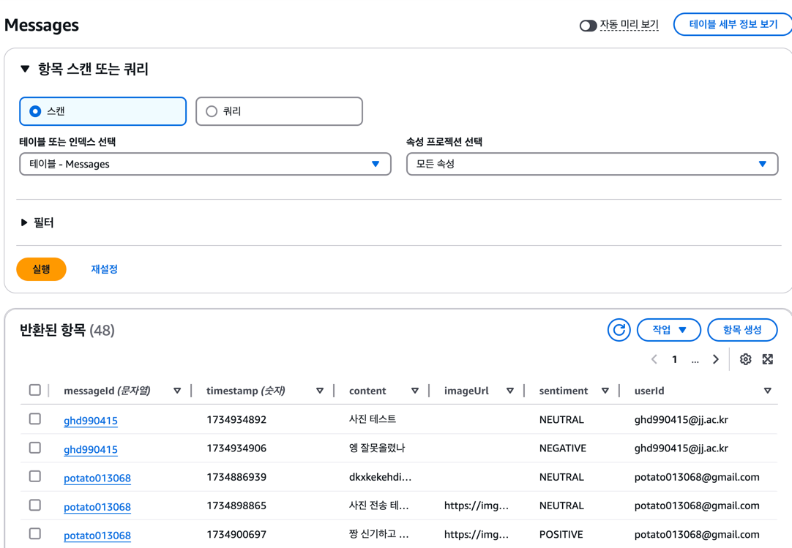

# 채팅 감정 기반 채팅 웹 애플리케이션
## 목적
수업에서 다루지 않은 AWS의 다양한 서비스를 활용한 채팅 웹 애플리케이션을 구현  

기존의 Cloud Computing에서 다루지 않았던 AWS에 어떤 서비스들이 있는지를 확인하고, 탐색하고 통합하며  
서버 인프라를 관리하지 않고, 이벤트 기반의 서버리스 아키텍처를 활용하여 채팅 웹 애플리케이션을 구현하는 것이 목적입니다.  
기존 수업에서 사용한 EC2, RDS, S3, EIP, ELB, EBS, EFS를 사용하지 않고, 다른 서비스들을 사용하여 서비스를 구축하는 것을 목표로 합니다.

## 시연 영상

## 구조
다음은 프로젝트의 전체적인 구조를 나타냅니다.
 

## 동작 설명 (사용자 관점)
1. 사용자는 웹 애플리케이션에 접속한다.
2. Conito를 통해서 인증을 수행한다. (로그인 및 회원가입)
3. 사용자는 메인 페이지인 채팅창으로 이동한다.
4. 사용자는 채팅을 입력하고, 전송한다.
5. 채팅을 입력할 때마다 어떤 감정을 가지고 있는지 분석하여, 감정을 표시한다.
6. 사진을 업로드하면, 사진이 업로드 및 표시된다.

## 동작 설명 (개발자 관점)
프런트는 React를 사용하여 구현하였으며, Amplify를 사용하여 AWS 서비스들을 쉽게 사용할 수 있도록 구성하였습니다.  
Amplify는 AWS Cognito 서비스와 연결되어 사용자 인증 및 권한 부여를 수행한 후 페이지를 연결시켜 줍니다  

메인 채팅 페이지에서 클라이언트가 접속하면, 그때부터 계속해서 polling을 수행하여 채팅 내용을 가져옵니다.  
클라이언트는 메시지 확인을 위해 API Gateway를 통해 Lambda 함수를 호출하여 DynamoDB에 저장된 채팅 내용을 가져옵니다.  
가져온 채팅 내용은 클라이언트에서 표시하게 됩니다.  

사용자가 메시지를 입력하면 클라이언트는 API Gateway를 통해 Lambda 함수를 호출하여 DynamoDB에 채팅 내용을 저장합니다.  
채팅 내용을 저장한 후, 감정 분석을 위해 OPEN AI API를 호출하여 감정을 분석하고, 그 결과를 DynamoDB에 저장합니다.  
이후 다시 클라이언트에서 채팅 내용을 가져오는 polling을 수행하여 채팅 내용 및 감정 분석 결과를 가져옵니다.

사용자가 사진을 업로드하면, 클라이언트는 S3에 사진을 업로드하고, 업로드한 사진의 URL을 DynamoDB에 저장합니다.  
또한, 사진을 S3에 저장할 때 AWS SNS를 통해 관리자에게 사진 저장 알림을 보내어, 사진이 업로드되었음을 알립니다.  
이후 다시 클라이언트에서 채팅 내용을 가져오는 polling을 수행하여 채팅 내용 및 사진 URL을 가져옵니다.

## 사용 기술
- AWS Amplify
- AWS Cognito
- AWS API Gateway
- AWS Lambda
- AWS DynamoDB
- AWS S3
- AWS SNS
- OPEN AI API
- React

## Database
다음은 DynamoDB의 Messages 테이블 구조를 나타냅니다.

- messageId (partition Key) 메시지 식별자
- timestamp (sort key) 메시지 정렬 기준이며, Unix시간을 사용
- userId: 로그인할 때 입력한 이메일
- content: 입력한 메시지 내용
- sentiment: 메시지의 분석 결과에 따른 긍/부정
- imageUrl: 이미지 열 수 있는 Url

## 람다 함수 코드
람다 함수 코드는 레포지토리 내의 Lambda 폴더에 존재합니다.  
node22 버전으로 작성되었습니다.

## 문제 및 해결방안
학생 계정의 제약으로 인해 AWS 서비스를 사용하는데 제약이 있었습니다.  
아래는 문제와 해결 방안입니다.

### Comprehend 사용 불가
텍스트 기반 감정 분석을 위해 Comprehend 서비스를 사용하려 했으나, 학생 계정으로는 사용이 불가능했습니다.  
그래서 AWS 내의 SageMaker를 통해서 감정 분석을 수행하려고 했으나, SageMaker를 사용하기에는 훈련과, 모델을 만드는데 시간이 부족했습니다.  

따라서 감정 분석 결과는 중립, 긍정, 부정으로만 나누면 되고,
사용해 본 적이 있는 OPEN AI API를 사용하여 감정 분석을 수행하였습니다.

### S3이미지 업로드와 SNS 알림
S3에 이미지를 업로드하고, SNS를 통해 알림을 보내는 것은 처음 해보는 것이었습니다.  
이를 위해 AWS SDK를 사용하여 S3에 이미지를 업로드하고, SNS를 통해 알림을 보내는 코드를 작성하였습니다.
하지만 이를 하는 도중 CORS 에러가 발생하였고, CloudWatch를 통해 로그를 확인하였습니다.  
이를 통해 React 코드와 Lambda 코드에서 데이터 가공을 제대로 해주지 못해 URL 이 제대로 저장되지 않는 문제가 있음을 확인하고 해결하였습니다.  

### Amplify와 React 연결
Amplify를 사용하여 AWS 서비스들을 쉽게 사용할 수 있도록 구성하였습니다.  
하지만 Amplify에 React 프로젝트를 배포할 때 라이브러리 충돌로 인한 오류가 발생하였습니다.  
이를 해결하기 위해 Amplify에서 요구하는 라이브러리 버전으로 모든 것들을 수동으로 변경하였습니다.

### Stack [CDKToolkit] already exists 에러
Amplify에 프로젝트를 올릴 때, Stack [CDKToolkit] already exists 에러가 발생하였습니다.  
이를 위해 CloudFormation에서 해당 스택을 삭제하고 프로젝트를 다시 올렸습니다.
하지만, 같은 에러가 발생하였습니다.

이를 찾다가 프로젝트를 초기화해서 진행하다가 Amplfiy Auth를 위해서 다음과 같이 `npm create amplify@latest`를 사용하여 Amplify 프로젝트를 생성하는 경우에 발생하는 문제임을 확인하였습니다.  

따라서 Amplify Auth를 사용하지 않고 Cognito에서 기본적으로 제공해 주는 기능을 사용하여 프로젝트를 진행하였습니다.

## REST API 사용한 이유
이 프로젝트의 목표는 다양한 AWS의 서비스를 통해서 쉽고 빠르게 서비스를 구축하는 것이 목표입니다.  
그래서 사용해보지 않은 Web Socket 대신 REST API를 사용하여 서비스를 구축하였습니다.

## 실행 방법
1. 레포지토리를 클론 합니다.
2. `npm install`을 통해 의존성을 설치합니다.
3. `npm start`를 통해 프로젝트를 실행합니다.

## 홈페이지 사진

 
 
 

## 참고
- [AWS Amplify](https://aws.amazon.com/ko/amplify/)
- [AWS Cognito](https://aws.amazon.com/ko/cognito/)
- [AWS API Gateway](https://aws.amazon.com/ko/api-gateway/)
- [AWS Lambda](https://aws.amazon.com/ko/lambda/)
- [AWS DynamoDB](https://aws.amazon.com/ko/dynamodb/)
- [AWS S3](https://aws.amazon.com/ko/s3/)
- [AWS SNS](https://aws.amazon.com/ko/sns/)
- [OPEN AI API](https://www.openai.com/)
- [React](https://ko.reactjs.org/)
